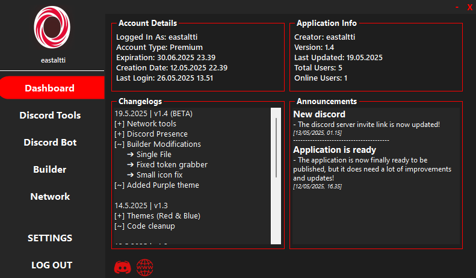
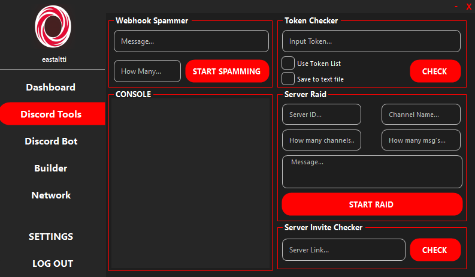
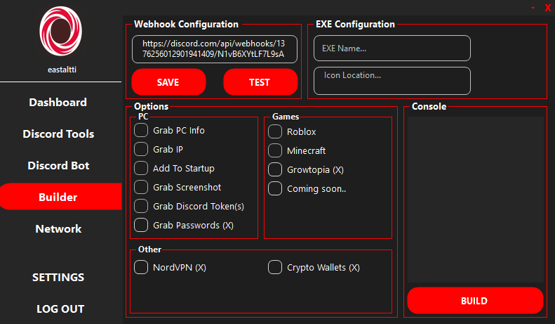
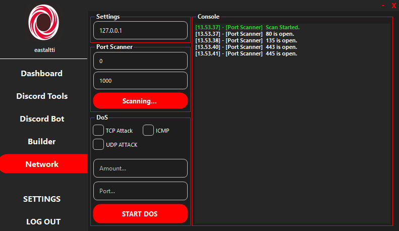

# Osprey V1.5
<p align="center">
   <a href="https://discord.gg/GsRGYddPNc">JOIN THE DISCORD</a>
</p>

   <h3 align="center">GROWTOPIA STEALER WORKING & COMING SOON</h1>

<p align="center" style="text-align: center"> 
  
</p>
   <h4 align="center">Preview Video:</h4>
   
[]([https://www.youtube.com/watch?v=Z_x5tuxniNA](https://www.youtube.com/watch?v=6SGLVDaUASU))

### Features
```
┌── ⚒️ - Discord Tools
│   ├── Token Checker
│   ├── Webhook Spammer
│   ├── Server Raid/Nuker
│   ├── Server Invite Checker
│   └── Token Sniper/Generator (Coming Soon)
│
├── 🕵️‍♂️ - Network
│   ├── Port Scanner
│   └── DoS Tool
│
├── 🚀 - Other
│   ├── Autologin
│   ├── Configuration
│   └── Themes
│
└── ☠️ - Virus Builder
    └── Stealer
        ├── System Info
        ├── IP Info
        ├── Add To Startup
        ├── Grab Discord Token(s)
        ├── Grab Passwords (Coming soon)
        ├── Roblox session
        ├── Minecraft session
        ├── Growtopia account (NEW)
        └── Crypto Wallets (Coming Soon)          
```

### To Do
- Mac addresses for growtopia
- Check hosts file for private servers (Growtopia)
  Why? Because then you can see if the victim has logged in to a private server or real growtopia server.
- Token Sniper
- Crypto Wallets
- Grab passwords
  
### Screenshots:
<p align="center">
   
   
   
  
  <br><br>
</p>
